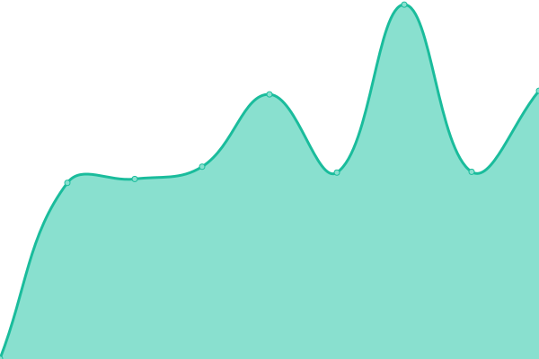
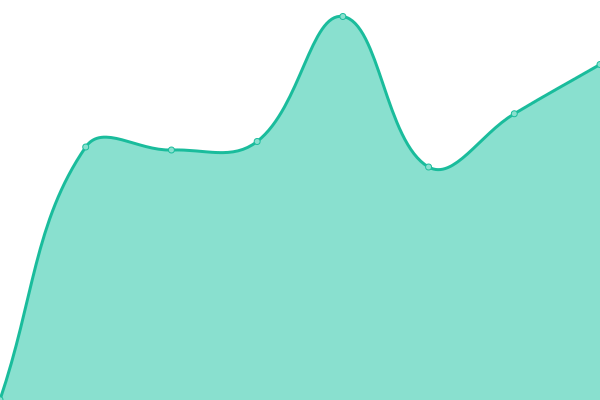
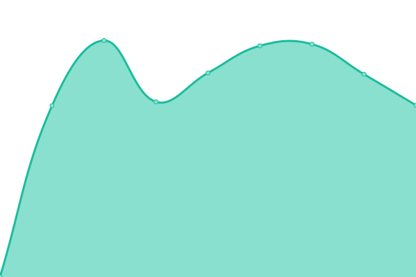

# [📈 Live Status](https://status.berkspar.com): <!--live status--> **🟧 Partial outage**

This repository contains the open-source uptime monitor and status page for [Felipe Passos](https://www.berkspar.com), powered by [Upptime](https://github.com/upptime/upptime).

With [Upptime](https://upptime.js.org), you can get your own unlimited and free uptime monitor and status page, powered entirely by a GitHub repository. We use [Issues](https://github.com/berkspar/upptime/issues) as incident reports, [Actions](https://github.com/berkspar/upptime/actions) as uptime monitors, and [Pages](https://status.berkspar.com) for the status page.

<!--start: status pages-->
<!-- This summary is generated by Upptime (https://github.com/upptime/upptime) -->
<!-- Do not edit this manually, your changes will be overwritten -->
<!-- prettier-ignore -->
| URL | Status | History | Response Time | Uptime |
| --- | ------ | ------- | ------------- | ------ |
|  [TFN](https://api.tfn.app.br) | 🟩 Up | [tfn.yml](https://github.com/BerkSpar/upptime/commits/HEAD/history/tfn.yml) | 

 1474ms
     
 | 

<a href="https://status.berkspar.com/history/tfn">100.00%</a>
    

|  [Remembeer [Production]](https://api.iremembeer.com) | 🟩 Up | [remembeer-production.yml](https://github.com/BerkSpar/upptime/commits/HEAD/history/remembeer-production.yml) | 

 856ms
     
 | 

<a href="https://status.berkspar.com/history/remembeer-production">100.00%</a>
    

|  [Remembeer [Development]](https://api.ibeer.app) | 🟩 Up | [remembeer-development.yml](https://github.com/BerkSpar/upptime/commits/HEAD/history/remembeer-development.yml) | 

 818ms
     
 | 

<a href="https://status.berkspar.com/history/remembeer-development">100.00%</a>
    

|  [Like a Bee](https://homolog.likeabee.com.br) | 🟩 Up | [like-a-bee.yml](https://github.com/BerkSpar/upptime/commits/HEAD/history/like-a-bee.yml) | 

 1038ms
     
 | 

<a href="https://status.berkspar.com/history/like-a-bee">100.00%</a>
    

|  [Pet Delivery](https://api.pet.delivery) | 🟥 Down | [pet-delivery.yml](https://github.com/BerkSpar/upptime/commits/HEAD/history/pet-delivery.yml) | 

 0ms
     
 | 

<a href="https://status.berkspar.com/history/pet-delivery">0.00%</a>
    

|  [O Gole](https://api.lf.app.br) | 🟩 Up | [o-gole.yml](https://github.com/BerkSpar/upptime/commits/HEAD/history/o-gole.yml) | 

 1276ms
     
 | 

<a href="https://status.berkspar.com/history/o-gole">100.00%</a>
    

|  [Rastrear LF](https://rastrear.lftecnologia.com.br) | 🟥 Down | [rastrear-lf.yml](https://github.com/BerkSpar/upptime/commits/HEAD/history/rastrear-lf.yml) | 

 1906ms
     
 | 

<a href="https://status.berkspar.com/history/rastrear-lf">93.85%</a>
    

<!--end: status pages-->

[**Visit our status website →**](https://status.berkspar.com)

## 📄 License

- Powered by: [Upptime](https://github.com/upptime/upptime)
- Code: [MIT](./LICENSE) © [Felipe Passos](https://www.berkspar.com)
- Data in the `./history` directory: [Open Database License](https://opendatacommons.org/licenses/odbl/1-0/)
